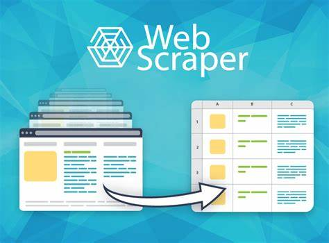

RemotePyScraper
RemotePyScraper is a Python-based web scraper for collecting job listings, particularly for remote jobs and entry-level positions in cybersecurity or any other field, by fetching data from both an API and HTML pages. The scraper exports the collected data into CSV, Excel, and JSON formats.

Features
Fetches job listings from a REST API using the httpx library.
Scrapes job data from Remote Python Jobs using BeautifulSoup and Parsel.
Filters jobs by experience level (e.g., entry-level).
Differentiates between remote and on-site positions based on job descriptions.
Exports job listings to CSV, Excel, and JSON formats.
Data Collected
The scraper collects the following information:

Job Title
Employer/Company
Location
Remote/On-site
Required Experience
Job Description
Salary (if available)
Job Posting URL
Installation
Clone the repository:

bash
Copy code
git clone https://github.com/your-username/remotepyscraper.git
cd remotepyscraper
Install the required dependencies:

bash
Copy code
pip install httpx parsel pandas
API Details
This scraper also integrates with the RapidAPI Jobs Search API. This API fetches job listings from platforms such as Indeed, LinkedIn, Glassdoor, and more. You can customize the API query for location, job type, and more.

API Endpoint:
https://jobs-search-api.p.rapidapi.com/getjobs

API Query Parameters:
search_term: The job title or keyword you want to search for (e.g., "cybersecurity", "web developer").
location: City or region where the job should be located (e.g., "mumbai").
results_wanted: Number of job listings to fetch (e.g., 5, 10, 50).
site_name: List of job sites to search on (e.g., ["indeed", "linkedin", "glassdoor"]).
distance: The distance from the location (in miles) within which jobs should be fetched.
job_type: Job type (e.g., "fulltime", "parttime").
is_remote: Boolean to specify whether you want only remote jobs (True) or both remote and on-site (False).
hours_old: Time frame (in hours) within which the jobs were posted (e.g., 72 for the last three days).
API Headers:
x-rapidapi-key: Your unique API key from RapidAPI.
x-rapidapi-host: The host name of the API (jobs-search-api.p.rapidapi.com).
Content-Type: Set to application/json.
Usage
1. API-Based Job Scraping
To fetch job listings using the API, customize the following parameters in the payload object within the script:

python
Copy code
payload = {
    "search_term": "web",
    "location": "mumbai",
    "results_wanted": 5,
    "site_name": ["indeed", "linkedin", "zip_recruiter", "glassdoor"],
    "distance": 50,
    "job_type": "fulltime",
    "is_remote": False,
    "linkedin_fetch_description": False,
    "hours_old": 72
}
The request will retrieve job listings matching these parameters.

2. Web Scraping (HTML)
The script also scrapes job listings from Remote Python Jobs using Parsel and BeautifulSoup.

python
Copy code
response = httpx.get("https://www.remotepython.com/jobs/")
selector = Selector(text=response.text)
jobs = []
It then parses the job title, description, URL, experience level, and job type (remote/on-site) and stores the results.

3. Saving Results
The data fetched from both the API and the website is exported to CSV, Excel, and JSON formats:

python
Copy code
# Set the save location for CSV, Excel, and JSON
save_path = r'C:\Users\81sig\Documents'

# Export to CSV
df.to_csv(f'{save_path}\\cyber_jobs.csv', index=False)

# Export to Excel
df.to_excel(f'{save_path}\\cyber_jobs.xlsx', index=False)

# Export to JSON
with open(f'{save_path}\\cyber_jobs.json', 'w') as json_file:
    json.dump(jobs, json_file, indent=4)
Make sure to update save_path to the appropriate directory on your system.

Running the Script
To run the script, simply execute:

bash
Copy code
python remotepyscraper.py
This will collect job data, filter it based on remote/on-site and experience level, and save it to the specified files.

Example Output
The job listings will be exported in the following format:

Job Title	URL	Experience	Job Type	Description
Python Developer	https://www.remotepython.com/job/1/	Entry-level	Remote	Short job description here
Cybersecurity Intern	https://www.remotepython.com/job/2/	N/A	On-site	No description available
Configuration
API Key: Make sure to replace the placeholder "x-rapidapi-key" with your actual RapidAPI key in the headers section:

python
Copy code
headers = {
    "x-rapidapi-key": "YOUR_RAPIDAPI_KEY",
    "x-rapidapi-host": "jobs-search-api.p.rapidapi.com",
    "Content-Type": "application/json"
}
Save Path: Modify the save_path variable in the script to specify where the CSV, Excel, and JSON files should be saved:

python
Copy code
save_path = r'C:\path\to\save\directory'
Requirements
Python 3.7+
Libraries:
httpx
parsel
pandas
openpyxl (for Excel support)
To install all the required packages, run:

bash
Copy code
pip install -r requirements.txt
License
This project is licensed under the MIT License. See the LICENSE file for details.

This README includes detailed information about both API usage and HTML scraping using BeautifulSoup and Parsel. It also provides clear instructions on running the script and configuring the necessary parameters. Let me know if you'd like to add more details or make further adjustments!
